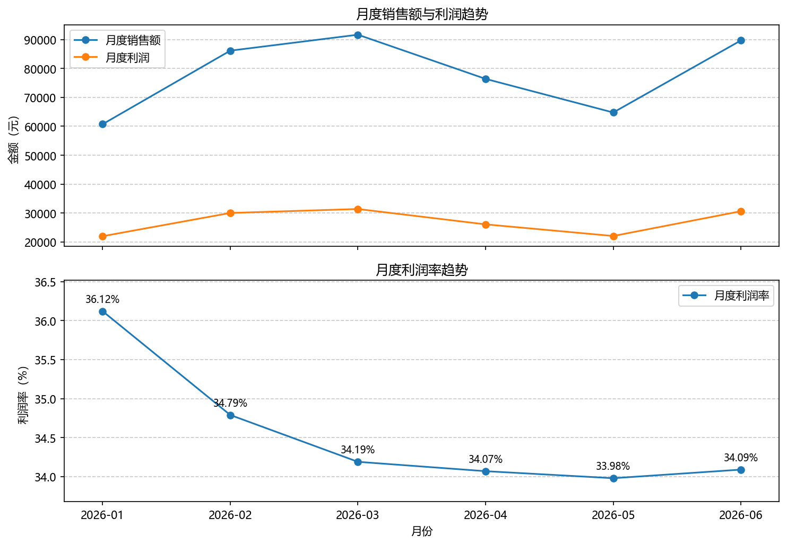
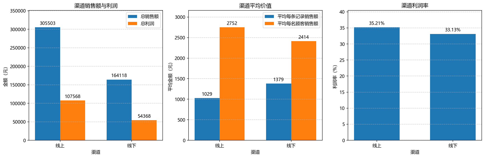
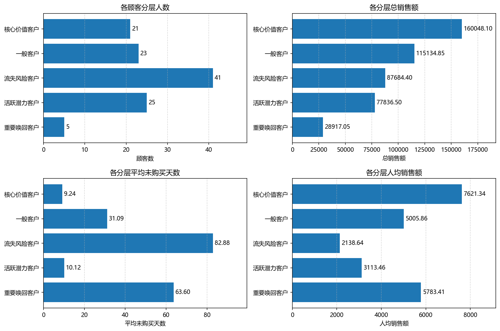

# 零售销售数据分析项目

## 项目简介

本项目基于一份覆盖2026年1月至6月的模拟零售销售数据，完成了从Excel原始数据清洗、MySQL数据存储，到Python数据分析和结果可视化的完整流程。分析内容包括总体经营情况、月度销售趋势、渠道表现和RFM顾客分层。最终输出清洗数据、异常数据、汇总表、分析报告和可视化图表。

## 技术栈

- 编程语言：Python 3.12.8
- 数据库：MySQL 8.0
- 数据处理：pandas、openpyxl
- 数据库连接：SQLAlchemy、PyMySQL
- 数据查询：SQL
- 数据可视化：matplotlib

## 主要分析内容

- 清洗原始销售数据，并记录异常数据及剔除原因
- 分析月度销售额、利润和利润率的变化趋势
- 对比线上与线下渠道的销售规模、顾客价值和利润率
- 使用RFM模型对顾客进行分层，并分析各分层的经营价值

## 数据清洗

原始数据共包含510条销售记录，主要进行了以下处理：

- 清理文本字段，并将日期、数量和单价转换为对应的Python数据类型
- 检查日期、顾客编号、数量、单价和订单状态等字段的有效性
- 删除完全重复的销售记录
- 合并商品信息表，并利用商品资料修复缺失的商品分类
- 将异常记录及对应的剔除原因单独保存，便于后续检查

清洗完成后，共保留487条有效记录，剔除23条异常或重复记录，且原始记录数与有效、剔除记录数能够正确对账。

## 可视化分析结果

### 月度经营表现



月度销售额与月度利润的变化趋势大致一致。销售额在3月达到最高，4月至5月连续下降，6月明显回升。月度利润率从1月的36.12%持续下降至5月的33.98%，6月回升至34.09%，较5月上升0.11个百分点。

### 渠道经营表现



线上渠道的总销售额、总利润和利润率均高于线下渠道。线下平均每条记录销售额为1379.14元，高于线上的1028.63元；但线上平均每名顾客销售额为2752.28元，高于线下的2413.50元，说明两个平均指标反映的是不同方面。

### RFM顾客分层



流失风险顾客共有41人，是人数最多的分层，其平均未购买天数达到82.88天。核心价值顾客虽然只有21人，但总销售额达到160048.10元，人均销售额7621.34元，均居各分层首位。重要唤回顾客只有5人，但人均销售额达到5783.41元，位居第二，具有较高的定向召回价值。

## 项目结构

```text
demo1/
├── project_day02.py
├── project_analysis.py
├── retail_sales_project_dataset.xlsx
├── requirements.txt
├── README.md
├── .gitignore
├── output/
│   ├── analysis_report.txt
│   ├── monthly_performance.png
│   ├── monthly_summary.csv
│   ├── channel_performance.png
│   ├── channel_summary.csv
│   ├── rfm_segment_analysis.png
│   ├── rfm_segment_summary.csv
│   ├── clean_sales.csv
│   ├── rejected_sales.csv
│   └── paid_profit_detail.csv
└── practice/
```

- `project_day02.py`：读取Excel原始数据，完成数据清洗、异常记录保存、商品信息合并和利润计算，并将结果导出为CSV文件及写入MySQL。
- `project_analysis.py`：从MySQL读取清洗后的成交数据，完成月度、渠道和RFM顾客分层分析，并生成汇总表、图表和分析报告。
- `output/`：保存3份清洗结果CSV、3份分析汇总CSV、3张可视化图表和1份经营分析报告。
- `practice/`：保存项目开发前期的Python、pandas和MySQL练习。

## 运行方法

### 1. 准备运行环境

- Python 3.12
- MySQL 8.0

### 2. 创建数据库

在MySQL中执行：

```sql
CREATE DATABASE IF NOT EXISTS summer_data
CHARACTER SET utf8mb4;
```

### 3. 安装项目依赖

在项目根目录执行：

```powershell
python -m pip install -r requirements.txt
```

### 4. 配置数据库密码

在Windows PowerShell当前会话中设置：

```powershell
$env:SUMMER_DB_PASSWORD="你的MySQL密码"
```

默认数据库配置如下：

- 地址：`127.0.0.1`
- 端口：`3306`
- 数据库：`summer_data`
- 用户名：`dong`

如果本机配置不同，需要修改两个Python脚本中的数据库连接参数。

### 5. 清洗并导入数据

```powershell
python project_day02.py
```

运行后生成：

- `clean_sales.csv`：清洗完成的487条有效销售记录
- `paid_profit_detail.csv`：416条已支付销售记录及其销售额、成本和利润
- `rejected_sales.csv`：23条字段异常或完全重复的记录

同时重新创建并覆盖以下MySQL数据表：

- `project_sales_clean`
- `project_paid_profit_detail`
- `project_rejected_sales`

### 6. 执行经营分析

```powershell
python project_analysis.py
```

运行后生成：

- `analysis_report.txt`：总体经营、月度、渠道和RFM顾客分层分析报告
- `monthly_performance.png`：月度销售额、利润和利润率趋势图
- `channel_performance.png`：线上与线下渠道经营指标对比图
- `rfm_segment_analysis.png`：RFM顾客分层图
- `monthly_summary.csv`：月度经营指标汇总
- `channel_summary.csv`：渠道经营指标汇总
- `rfm_segment_summary.csv`：RFM顾客分层指标汇总

## 项目局限

- 数据量较小，时间跨度仅半年，且使用模拟数据，因此分析结论的外推能力有限。
- 缺少促销活动、渠道流量、库存和顾客属性等数据，无法进一步解释销售变化的具体原因。
- 经营建议尚未经过实际验证，执行前应通过实验组与对照组或后续数据进行效果评估。